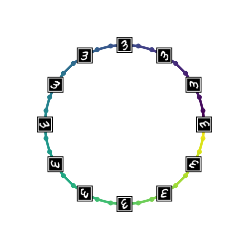
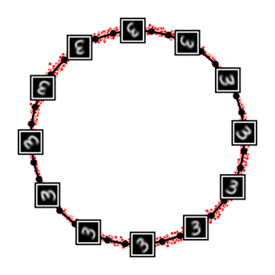

# Graph Geometry-Preserving Autoencoders
The official repository for \<Graph Geometry-Preserving Autoencoders\> (Lim, Kim, Lee, Jang, and Park, ICML 2024)

> This paper proposes Graph Geometry-Preserving Autoencoder (GGAE), a regularized autoencoder trained by minimizing the *reconstruction error + distortion measure of graph geometry*. It produces latent representation that preserves shortest-path distances along a graph connecting data points by semantic distances or similarity.

## Preview
### 1. Swiss Roll

 
 

  <I>Figure 2: <b>(Left)</b> An ideal latent representation, <b>(Middle)</b> distorted representation obtained by AE, and <b>(Right)</b> graph geometry-preserving representation obtained by GGAE. </I>

 

### 2. Rotating MNIST

 
 

  <I>Figure 2: <b>(Left)</b> An ideal latent representation, <b>(Middle)</b> distorted representation obtained by AE, and <b>(Right)</b> graph geometry-preserving representation obtained by GGAE. </I>

 

### 3. dSprites

 
 

  <I>Figure 2: <b>(Left)</b> An ideal latent representation, <b>(Middle)</b> distorted representation obtained by AE, and <b>(Right)</b> graph geometry-preserving representation obtained by GGAE. </I>

 

## Environment

The project is developed under a standard PyTorch environment.
- python 3.7
- numpy
- matplotlib
- scikit-learn
- tqdm
- argparse
- omegaconf
- tensorboardX
- torch 1.13.1